# 💸 Blockchain-Based Microloan Payment System

A **Blockchain-based Microloan Platform** that enables borrowers and lenders to connect **directly without banks or intermediaries**.  
This decentralized application (DApp) leverages **Ethereum smart contracts** to automate loan creation, funding, and repayment — ensuring **transparency, security, and financial inclusion**.

---

## 🚀 Features

- 👤 **Borrower Dashboard** — Request loans, view loan history, and track repayment status.  
- 💰 **Lender Dashboard** — Browse available loans, fund them securely, and monitor repayments.  
- 🔐 **Smart Contracts (Solidity)** — Automatically handle loan approval, funding, and repayments.  
- 💳 **Credit Scoring System** — Dynamic score updates based on repayment behavior.  
- 🌐 **MetaMask Integration** — Secure Ethereum wallet connection for transactions.  
- 📊 **Transparent Records** — Every transaction is stored permanently on the blockchain.  
- 🎨 **Modern UI** — Clean, responsive interface built for a smooth Web3 experience.

---

## 🧠 Tech Stack

| Layer                 | Technology Used            |
|-----------------------|----------------------------|
| **Frontend**          | HTML, CSS, JavaScript      |
| **Blockchain**        | Solidity (Smart Contracts) |
| **Web3 Library**      | Ethers.js                  |
| **Wallet**            | MetaMask                   |
| **Local Blockchain**  | Hardhat                    |
| **IDE / Code Editor** | Visual Studio Code         |

---

## ⚙️ Smart Contract Functionalities

- **Request Loan** → Borrowers can request loans by specifying amount, interest, and due date.  
- **Fund Loan** → Lenders can fund pending loans directly through the platform.  
- **Repay Loan** → Borrowers can repay funded loans automatically using smart contracts.  
- **Default Detection** → The contract marks overdue loans as defaulted automatically.  
- **Credit Score System** → Borrower’s credit score changes dynamically based on repayment performance.

---

## 🧩 How to Run Locally

### 1️⃣ Clone the Repository
```bash
git clone https://github.com/divyapatel30/Blockchain-Microloan-System.git
cd Blockchain-Microloan-System
2️⃣ Install Dependencies
npm install
3️⃣ Start Local Blockchain (Hardhat)
npx hardhat node

4️⃣ Deploy Smart Contract
npx hardhat run scripts/deploy.js --network localhost
5️⃣ Run the Frontend

Open index.html in your browser.

Connect your MetaMask wallet to localhost:8545.

Interact with the DApp 🎉

🧰 Additional Requirements

Before running the project, make sure you have these installed:

Requirement	Description
Node.js (v18 or above)	Required to run Hardhat and npm commands
npm (Node Package Manager)	Comes with Node.js
Hardhat	Local Ethereum blockchain development environment
MetaMask Browser Extension	To connect wallet and interact with smart contracts
Ethers.js	JavaScript library to communicate with Ethereum blockchain
Visual Studio Code	Recommended code editor
Google Chrome / Brave Browser	Compatible browsers for MetaMask
Solidity Compiler (via Hardhat)	For compiling and deploying smart contracts

Optional (for better development experience):

✅ Hardhat Toolbox Plugin — For advanced testing and debugging

✅ Live Server Extension (VS Code) — To preview frontend easily

✅ Ganache — Alternative to Hardhat for testing blockchain locally

🔒 Smart Contract Overview
struct Loan {
    uint id;
    address borrower;
    address lender;
    uint amount;
    uint interest;
    uint dueDate;
    bool isFunded;
    bool isRepaid;
    bool isDefaulted;
}


Key Functions:

requestLoan() — Borrower requests a loan.

fundLoan() — Lender funds the requested loan.

repayLoan() — Borrower repays the loan.

checkDefault() — Checks if loan is overdue.

getCreditScore() — Retrieves borrower’s credit score.

📸 Screenshots:

Home Page:
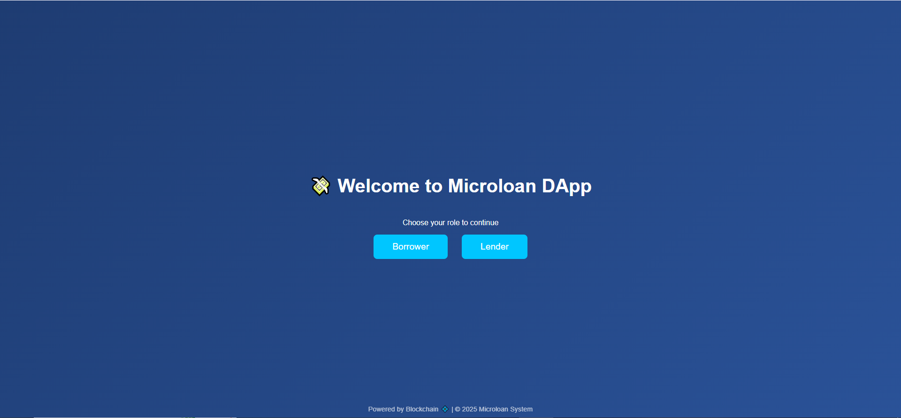

Borrower Dashboard
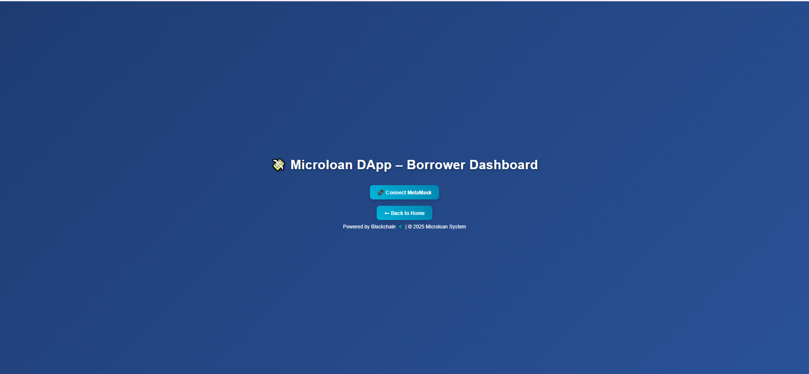
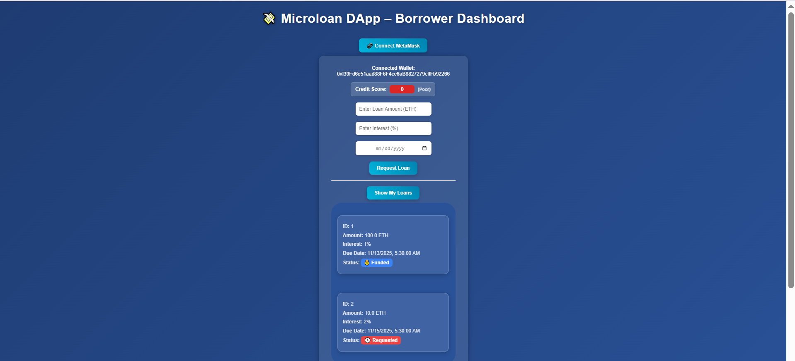
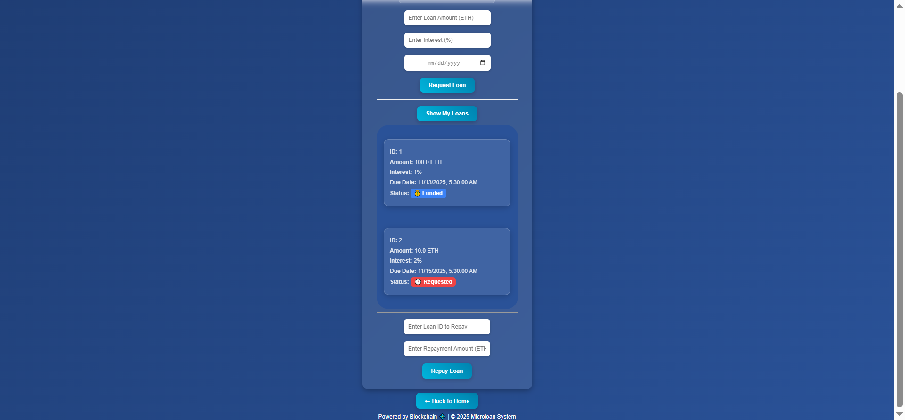

Lender Dashboard
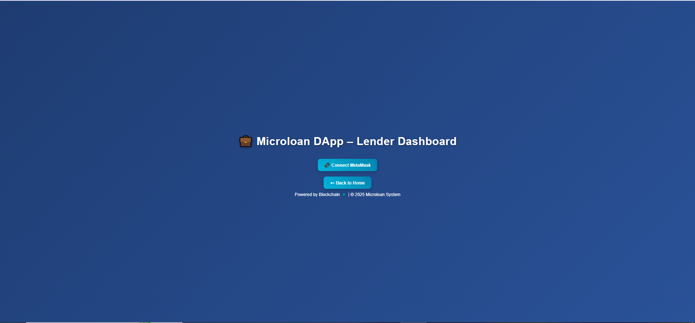
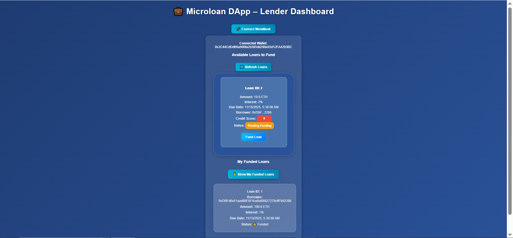

Loan Cards(Borrower)
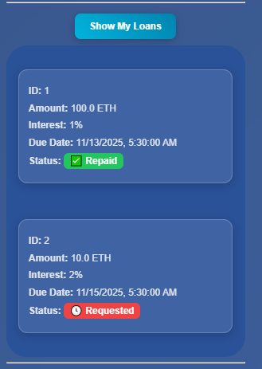
Loan Cards(Lender)
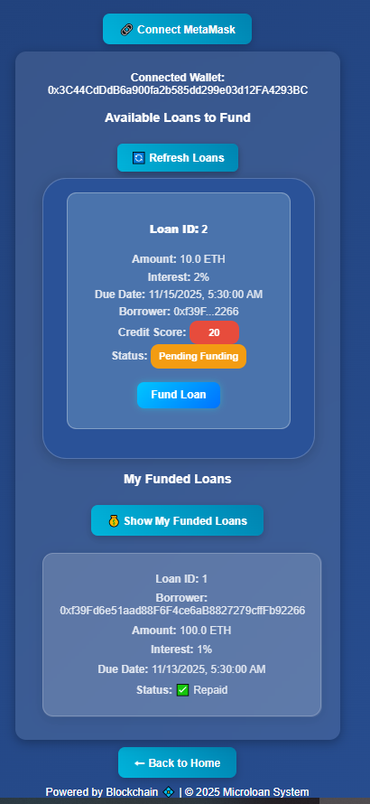

Credit Score Display
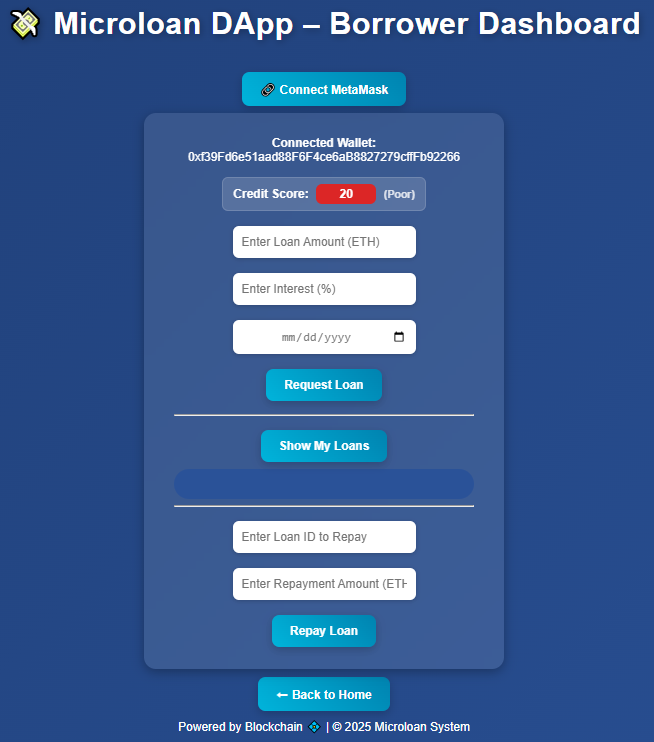

Repay Loan
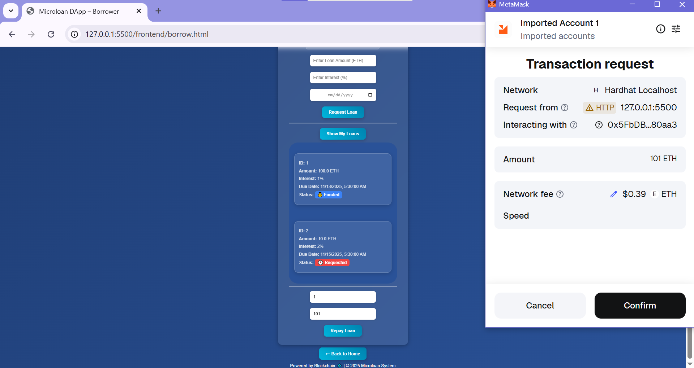
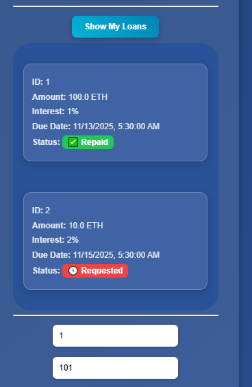

MetaMask Transaction Popup


👩‍💻 Developer

Divya Patel
📧 divyapatel3043@gmail.com

🪙 License

This project is licensed under the MIT License — you’re free to use, modify, and distribute it.
